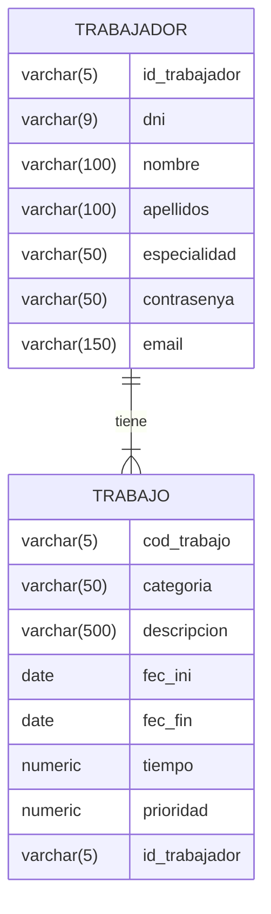

<!-- Links references -->

[MiguelColl]: https://github.com/MiguelColl

[LtVish]: https://github.com/LtVish

[DanielAlmazan]: https://github.com/DanielAlmazan

[HotelNest]: https://github.com/DanielAlmazan/hotel-nest
[TaskLynxFX]: https://github.com/DanielAlmazan/TaskLynx-JavaFX


<div style='text-align: center;'>

[](https://iessanvicente.com/)

</div>


# TaskLynx-SpringBoot

> SpringBoot project for 'Acceso a Datos' (Data Access) subject


> [!IMPORTANT]  
> Field 'contrasenya' in TRABAJADOR is 'contraseña' due to exercise specifications.

> [!NOTE]  
> This project is part of [Hotel Nest][HotelNest], [TaskLynx FX][TaskLynxFX] projects and other projects still in development.

> [!CAUTION]  
> The file application.properties is not included in the repository because authors have different configurations. However, the file is required to run the project.

### /src/main/resources/application.properties
```properties
spring.application.name=TaskLynx-SpringBoot
spring.datasource.url=jdbc:postgresql://localhost:5432/tasklynxDB?useSSL=false
spring.datasource.username={{ username }}
spring.datasource.password={{ password }}
spring.datasource.driver-class-name=org.postgresql.Driver
spring.jpa.database-platform=org.hibernate.dialect.PostgreSQLDialect
spring.jpa.hibernate.ddl-auto=none
logging.level.org.hibernate.SQL=debug
server.port=8443
server.ssl.key-store=classpath:TLKey.p12
server.ssl.key-store-password=
server.ssl.key-alias=TLKey
server.ssl.key-password=
server.ssl.key-store-type=pkcs12
```

## Entity Relationship Diagram for tasklynxDB




# Project requirements

## API Development
> [!WARNING]  
> Pendiente de implementar sistema de "autenticación". Está implementado el endpoint 
> `/api/trabajadores/{nombre}/{contraseña}`, el cual comprueba que exista un usuario con 
> ese nombre y contraseña y devuelve el propio usuario. Por otra parte, tenemos los siguientes endpoints:
> 
> - `/api/trabajadores/{id}/trabajos`
> - `/api/trabajadores/{id}/trabajos/pendientes`
> - `/api/trabajadores/{id}/trabajos/completados`
> 
> Cada uno hace lo que se intuye por sus nombres.
> Falta decidir cómo abordar la autenticación

* [ ] Obtener trabajos pendientes (login para el trabajador en la app móvil)
  * Pasándole por parámetros el ID de usuario y la contraseña, si
    coinciden en la BD, devolverá una lista de todos los trabajos
    pendientes de ese trabajador (es decir, con el fec_fin a null)  

* [x] Obtener trabajos finalizados
    * Función similar al de pendientes, pero mostrando los trabajos
      finalizados por ese trabajador.

* [x] Finalizar trabajo
    * Pasándole la fecha actual, actualizará ese trabajo en la tabla,
      poniéndole esa fecha en la columna fec_fin, de tal manera que
      se marque ese trabajo como finalizado

* [x] Asignar trabajo
    * Pasándole el ID de un trabajador, se le asigna ese trabajo al
      trabajador, actualizando la columna clave ajena que hay en la
      tabla trabajo. Este método deberá comprobar que la categoría
      del trabajo y la especialidad del trabajador coinciden, y de no
      ser así devolverá un error

* [x] Crear trabajo con trabajador asignado
    * Crear un trabajo con un ID de trabajador ya asignado, que se le
      pasará por parámetros

* [x] Listar tareas sin asignar
    * Este método mostrará el detalle de todas las tareas sin asignar,
      mostrando toda la información de cada uno de ellos.

* [x] Listar tareas sin realizar (de todos los trabajadores)
    * Mostrará el detalle de todas las tareas sin finalizar de todos los
      trabajadores.

* [x] Listar tareas realizadas (de todos los trabajadores)
    * Devolverá el detalle de todas las tareas realizadas por todos los
      trabajadores.

* [x] Listar tareas por trabajador entre fechas
    * Mostrará todas las tareas finalizadas por un trabajador
      concreto, entre dos fechas específicas.

* [x] Listar tareas de un trabajador ordenadas por prioridad
    * Mostrará todas las tareas pendientes de un trabajador concreto,
      ordenadas por prioridad (De la 1 -urgente- a la 4 -menos
      urgente-)

* [x] Listar tareas de un trabajador de una prioridad concreta
    * Mostrará las tareas pendientes de un trabajador, solo de la
      prioridad que se le pase en la petición (Por ejemplo, solo las de
      prioridad 1 para las más urgentes)

---

### Authors

#### TRABAJADOR CRUD: [Aitor Moreno Iborra][LtVish] <a href="https://github.com/LtVish"></a>

#### TRABAJO CRUD: [Miguel Collado][MiguelColl] <a href="https://github.com/MiguelColl"></a>

#### API Development: [Daniel Enrique Almazán Sellés][DanielAlmazan] <a href="https://github.com/DanielAlmazan"></a>
