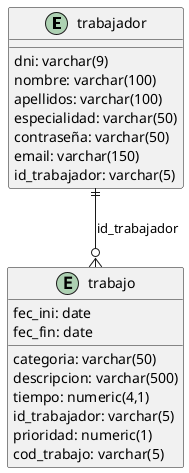

<!-- Links references -->

[MiguelColl]: https://github.com/MiguelColl

[LtVish]: https://github.com/LtVish

[DanielAlmazan]: https://github.com/DanielAlmazan

[HotelNest]: https://github.com/DanielAlmazan/hotel-nest
[TaskLynxFX]: https://github.com/DanielAlmazan/TaskLynx-JavaFX

{width=300}

# TaskLynx – API – Home

## Introducción

TaskLynx es un sistema compuesto por TaskLynx Api, TaskLynx Business y TaskLynx Mobile.  
TaskLynx Api es una API REST que permite la comunicación entre TaskLynx Business y TaskLynx Mobile.

## Tecnologías

- Java 21
- Spring Boot 2.5.4
- Apache Maven 3.9.6
- PostgreSQL

## Diagrama Entidad-Relación

## Diagrama de Clases

```plantuml
@startuml

!theme plain
top to bottom direction
skinparam linetype ortho

interface ITrabajadorDAO << interface >> {
  + findByNameAndPass(String, String): Trabajador
}
interface ITrabajadorService << interface >> {
  + findByNameAndPass(String, String): Trabajador
  + delete(String): void
  + findAll(): List<Trabajador>
  + findById(String): Trabajador
  + save(Trabajador): Trabajador
}
interface ITrabajoDAO << interface >> {
  + findCompletadosPorTrabajadorEntreFechas
        (String, LocalDate, LocalDate): List<Trabajo>
  + findByIdTrabajadorIdTrabajadorAndFecFinIsNullAndPrioridad
        (String, BigDecimal): List<Trabajo>
  + findPendienteByTrabajador(String): List<Trabajo>
  + findByIdAndUnassigned(String): Trabajo
  + findByIdTrabajadorIdTrabajadorAndFecFinIsNullOrderByCategoria
        (String): List<Trabajo>
  + findCompletaByTrabajador(String): List<Trabajo>
  + findByFecFinIsNotNull(): List<Trabajo>
  + findByIdTrabajadorIsNull(): List<Trabajo>
  + findByFecFinIsNull(): List<Trabajo>
}
interface ITrabajoService << interface >> {
  + findCompletadosPorTrabajadorEntreFechas
        (String, LocalDate, LocalDate): List<Trabajo>
  + findCompletadosPorTrabajador(String): List<Trabajo>
  + findPendientesPorTrabajadorYPrioridad
        (String, BigDecimal): List<Trabajo>
  + delete(String): void
  + findTrabajosSinTrabajador(): List<Trabajo>
  + editarTiempo(String, BigDecimal): Trabajo
  + findPendientes(): List<Trabajo>
  + findCompletados(): List<Trabajo>
  + findPendientesPorTrabajador(String): List<Trabajo>
  + finalizarTrabajo(String, LocalDate, BigDecimal): Trabajo
  + findPendientesPorTrabajadorOrderByPrioridad(String): List<Trabajo>
  + findAll(): List<Trabajo>
  + save(Trabajo): Trabajo
  + crearTrabajoConTrabajador(Trabajo, String): Trabajo
  + editarFechaFin(String, LocalDate): Trabajo
  + findById(String): Trabajo
  + asignarTrabajo(String, String): Trabajo
}
class IndexController {
  + IndexController(): 
  + index(Model): String
}
class TaskLynxSpringBootApplication {
  + TaskLynxSpringBootApplication(): 
  + main(String[]): void
  ~ hiddenHttpMethodFilter(): HiddenHttpMethodFilter
}
class Trabajador {
  + Trabajador(): 
  + Trabajador(String, String, String, String, String, String): 
  - idTrabajador: String
  - nombre: String
  - apellidos: String
  - email: String
  - dni: String
  - trabajos: Set<Trabajo>
  - especialidad: String
  - contraseña: String
   apellidos: String
   email: String
   nombre: String
   contraseña: String
   idTrabajador: String
   dni: String
   especialidad: String
   trabajos: Set<Trabajo>
}
class TrabajadorServices {
  + TrabajadorServices(): 
  + findByNameAndPass(String, String): Trabajador
  + delete(String): void
  + findAll(): List<Trabajador>
  + findById(String): Trabajador
  + save(Trabajador): Trabajador
}
class TrabajadoresController {
  + TrabajadoresController(): 
  + indexOneTrabajos(String): ResponseEntity<?>
  + indexOneTrabajosCompletados(String): ResponseEntity<?>
  + update(Trabajador, String, BindingResult): ResponseEntity<?>
  - showErrors(BindingResult, Map<String, Object>): boolean
  + indexOneTrabajosPendientes(String): ResponseEntity<?>
  + create(Trabajador, BindingResult): ResponseEntity<?>
  + indexAll(): ResponseEntity<?>
  + indexOneByUsuarioAndContraseña(String, String): ResponseEntity<?>
  + indexOne(String): ResponseEntity<?>
  + delete(String): ResponseEntity<?>
}
class TrabajadoresViewController {
  + TrabajadoresViewController(): 
  + editarTrabajador(Model, String): String
  + create(Trabajador, BindingResult, Model): ModelAndView
  + verTrabajador(Model, String): String
  + anyadirTrabajador(Model): String
  + edit(Trabajador, BindingResult, Model): ModelAndView
  + delete(String): ModelAndView
  - addAtributes(Model): void
  + indexTrabajadores(Model): String
}
class Trabajo {
  + Trabajo(): 
  - descripcion: String
  - prioridad: BigDecimal
  - fecFin: LocalDate
  - tiempo: BigDecimal
  - codTrabajo: String
  - fecIni: LocalDate
  - idTrabajador: Trabajador
  - categoria: String
   descripcion: String
   prioridad: BigDecimal
   idTrabajador: Trabajador
   codTrabajo: String
   tiempo: BigDecimal
   fecIni: LocalDate
   fecFin: LocalDate
   categoria: String
}
class TrabajoController {
  + TrabajoController(): 
  + showById(String): ResponseEntity<?>
  + delete(String): ResponseEntity<?>
  + create(Trabajo, BindingResult): ResponseEntity<?>
  + showAll(): ResponseEntity<?>
  - checkErrors(BindingResult, Map<String, Object>): boolean
  + update(Trabajo, String, BindingResult): ResponseEntity<?>
}
class TrabajoServices {
  + TrabajoServices(): 
  + findPendientesPorTrabajadorOrderByPrioridad(String): List<Trabajo>
  + findPendientesPorTrabajadorYPrioridad
        (String, BigDecimal): List<Trabajo>
  + findCompletadosPorTrabajadorEntreFechas
        (String, LocalDate, LocalDate): List<Trabajo>
  + findCompletadosPorTrabajador(String): List<Trabajo>
  + editarTiempo(String, BigDecimal): Trabajo
  + findAll(): List<Trabajo>
  + findTrabajosSinTrabajador(): List<Trabajo>
  + crearTrabajoConTrabajador(Trabajo, String): Trabajo
  + asignarTrabajo(String, String): Trabajo
  + findCompletados(): List<Trabajo>
  + finalizarTrabajo(String, LocalDate, BigDecimal): Trabajo
  + delete(String): void
  - validateDate(Trabajo, LocalDate): LocalDate
  + findPendientes(): List<Trabajo>
  + save(Trabajo): Trabajo
  + editarFechaFin(String, LocalDate): Trabajo
  + findById(String): Trabajo
  - validateTime(BigDecimal, BigDecimal): BigDecimal
  + findPendientesPorTrabajador(String): List<Trabajo>
}
class TrabajoViewController {
  + TrabajoViewController(): 
  + createTrabajo(Trabajo, BindingResult, Model): ModelAndView
  + indexTrabajos(Model): String
  + editarTrabajo(Model, String): String
  + nuevoTrabajo(Model): String
}

Trabajador                  "1" *-[#595959,plain]-> "trabajos\n*" Trabajo
TrabajadorServices          "1" *-[#595959,plain]-> "trabajadorDAO\n1" ITrabajadorDAO     
TrabajadorServices           -[#008200,dashed]-^  ITrabajadorService
TrabajadoresController      "1" *-[#595959,plain]-> "trabajadorService\n1" ITrabajadorService         
TrabajadoresController      "1" *-[#595959,plain]-> "trabajoService\n1" ITrabajoService      
TrabajadoresViewController  "1" *-[#595959,plain]-> "trabajadorServices\n1" TrabajadorServices          
Trabajo                     "1" *-[#595959,plain]-> "idTrabajador\n1" Trabajador    
TrabajoController           "1" *-[#595959,plain]-> "trabajoService\n1" ITrabajoService      
TrabajoServices             "1" *-[#595959,plain]-> "trabajadorDAO\n1" ITrabajadorDAO     
TrabajoServices             "1" *-[#595959,plain]-> "trabajoDAO\n1" ITrabajoDAO  
TrabajoServices              -[#008200,dashed]-^  ITrabajoService
TrabajoViewController       "1" *-[#595959,plain]-> "trabajadorServices\n1" TrabajadorServices          
TrabajoViewController       "1" *-[#595959,plain]-> "trabajoServices\n1" TrabajoServices       
@enduml
```

## Authors

### TRABAJADOR CRUD:

[Aitor Moreno Iborra][LtVish]

### TRABAJO CRUD:
[Miguel Collado][MiguelColl]

### API Development:

[Daniel Enrique Almazán Sellés][DanielAlmazan]
