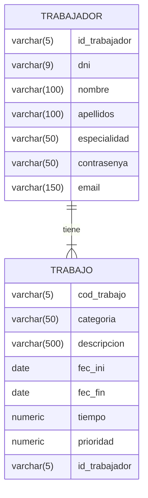

{width=300}

# TaskLynx – API – Home

## Introducción

TaskLynx es un sistema compuesto por TaskLynx Api, TaskLynx Business y TaskLynx Mobile.  
TaskLynx Api es una API REST que permite la comunicación entre TaskLynx Business y TaskLynx Mobile.

## Tecnologías

- Java 21
- Spring Boot 2.5.4
- Apache Maven 3.9.6
- PostgreSQL

## Diagrama Entidad-Relación

> **Importante**
> 
> El campo `contrasenya`, en realidad es `contraseña`. Se ha cambiado únicamente 
> en el diagrama por motivos de renderizado de caracteres no UTF-8.
> 
{style=warning}

